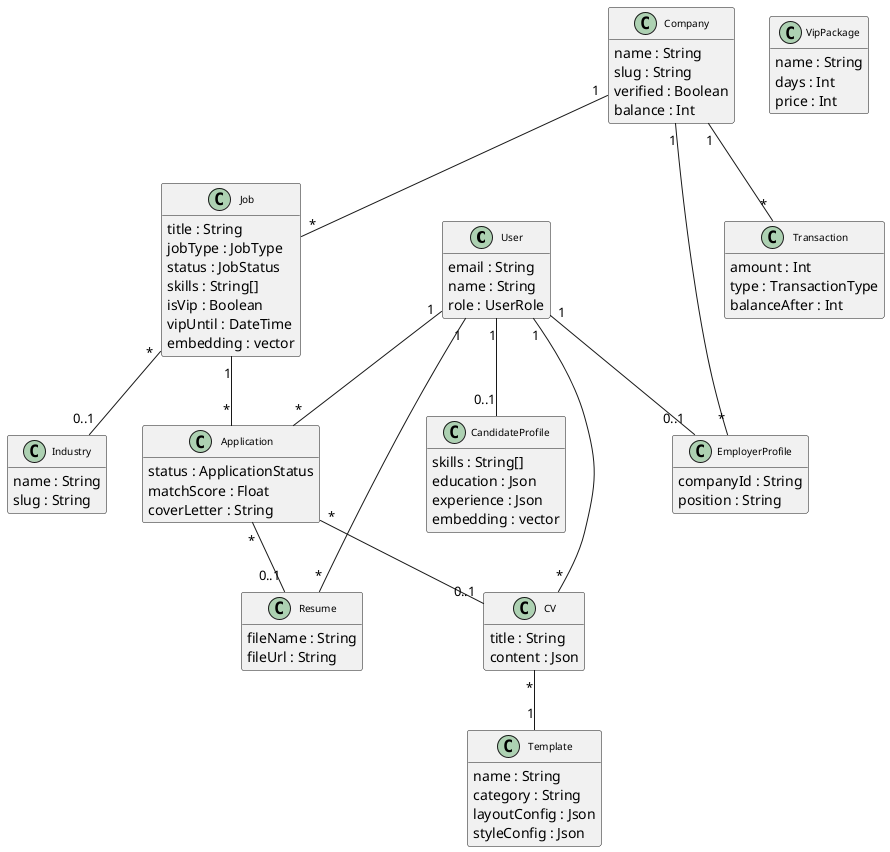
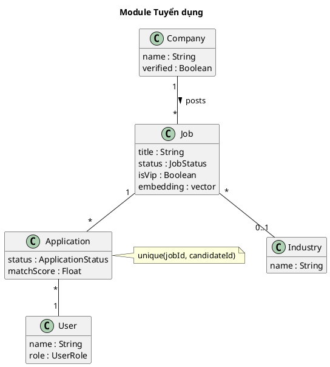
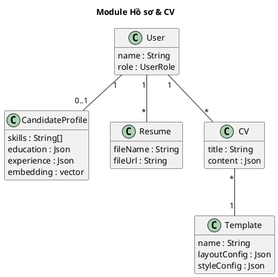
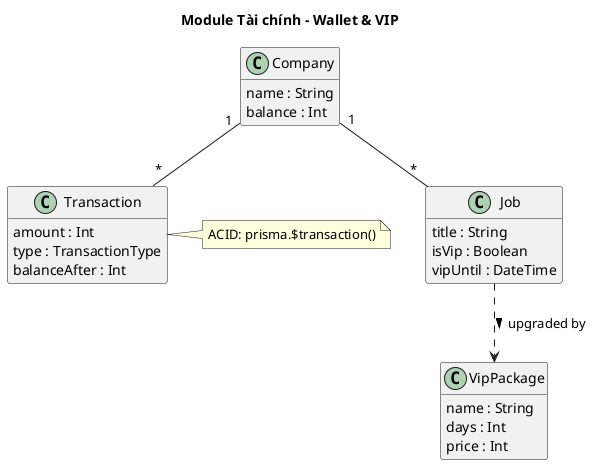

# Mã PlantUML - Sơ đồ Class hệ thống JobNow

---

## CD-01: Sơ đồ Class tổng thể

Chỉ gồm 12 bảng cốt lõi. Bỏ: Blog, Skill, SearchKeyword, Notification, SavedJob.

---

## CD-02: Module Tuyển dụng

---

## CD-03: Module Hồ sơ & CV

---

## CD-04: Module Tài chính

---

## Hướng dẫn

1. Paste vào [PlantUML Online](https://www.plantuml.com/plantuml/uml/).
2. VS Code: Extension "PlantUML" → `Alt+D`.
3. Export PNG/SVG chèn vào Word.
