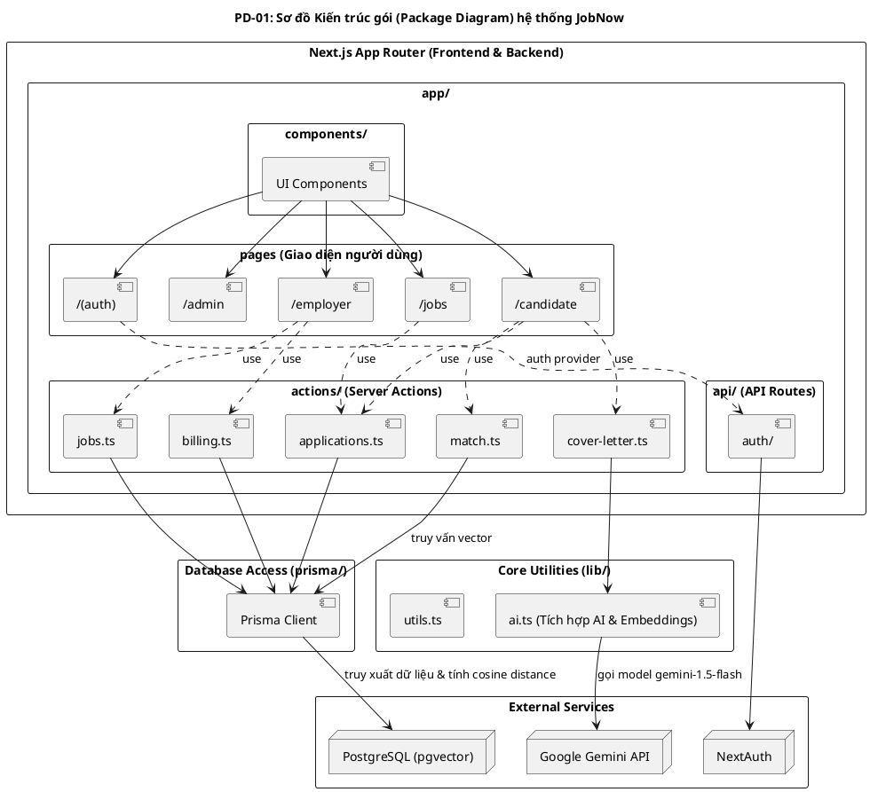
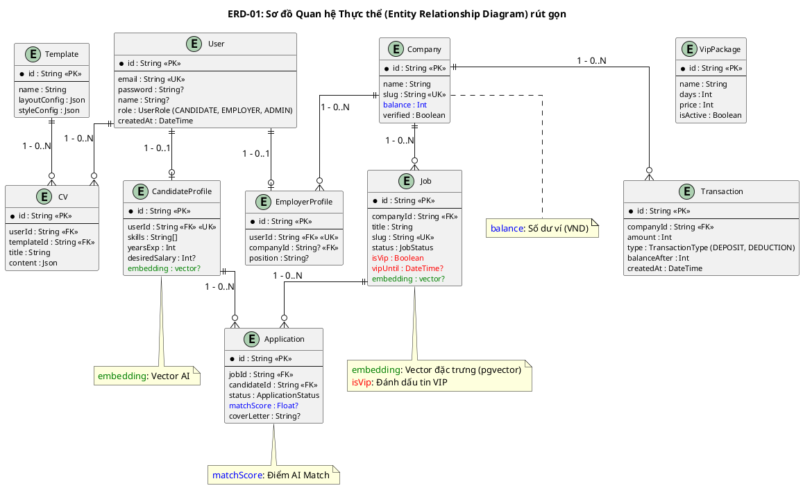

# Mã PlantUML - Sơ đồ Gói (Package Diagram) & Sơ đồ ERD

---

## PD-01: Sơ đồ Gói (Package Diagram)

```plantuml
@startuml PD01_PackageDiagram
skinparam packageStyle rectangle
skinparam componentStyle uml2
title PD-01: Sơ đồ Kiến trúc gói (Package Diagram) hệ thống JobNow

package "Next.js App Router (Frontend & Backend)" {
  package "app/" {
    package "pages (Giao diện người dùng)" {
      [/(auth)] as AuthPages
      [/admin] as AdminPages
      [/employer] as EmployerPages
      [/candidate] as CandidatePages
      [/jobs] as JobsPages
    }
    
    package "components/" {
      [UI Components]
    }
    
    package "actions/ (Server Actions)" {
      [jobs.ts]
      [billing.ts]
      [applications.ts]
      [cover-letter.ts]
      [match.ts]
    }
    
    package "api/ (API Routes)" {
      [auth/] as AuthAPI
    }
  }
}

package "Core Utilities (lib/)" {
  [ai.ts (Tích hợp AI & Embeddings)]
  [utils.ts]
}

package "Database Access (prisma/)" {
  [Prisma Client]
}

package "External Services" {
  node "Google Gemini API" as GeminiAPI
  node "PostgreSQL (pgvector)" as PostgreSQL
  node "NextAuth" as NextAuthSvc
}

' Relationships
[UI Components] --> AuthPages
[UI Components] --> AdminPages
[UI Components] --> EmployerPages
[UI Components] --> CandidatePages
[UI Components] --> JobsPages

EmployerPages ..> [billing.ts] : use
EmployerPages ..> [jobs.ts] : use
CandidatePages ..> [applications.ts] : use
CandidatePages ..> [cover-letter.ts] : use
CandidatePages ..> [match.ts] : use
JobsPages ..> [applications.ts] : use

[jobs.ts] --> [Prisma Client]
[billing.ts] --> [Prisma Client]
[applications.ts] --> [Prisma Client]

[cover-letter.ts] --> [ai.ts (Tích hợp AI & Embeddings)]
[match.ts] --> [Prisma Client] : truy vấn vector

[ai.ts (Tích hợp AI & Embeddings)] --> GeminiAPI : gọi model gemini-1.5-flash

AuthPages ..> AuthAPI : auth provider
AuthAPI --> NextAuthSvc

[Prisma Client] --> PostgreSQL : truy xuất dữ liệu & tính cosine distance
@enduml
```

---

## ERD-01: Sơ đồ Quan hệ Thực thể (ERD)

```plantuml
@startuml ERD01_Database
skinparam linetype ortho
skinparam classFontSize 12
skinparam classAttributeFontSize 11
title ERD-01: Sơ đồ Quan hệ Thực thể (Entity Relationship Diagram) rút gọn

entity "User" as user {
  * id : String <<PK>>
  --
  email : String <<UK>>
  password : String?
  name : String?
  role : UserRole (CANDIDATE, EMPLOYER, ADMIN)
  createdAt : DateTime
}

entity "CandidateProfile" as candidate {
  * id : String <<PK>>
  --
  userId : String <<FK>> <<UK>>
  skills : String[]
  yearsExp : Int
  desiredSalary : Int?
  <color:green>embedding : vector?</color>
}

entity "EmployerProfile" as employer {
  * id : String <<PK>>
  --
  userId : String <<FK>> <<UK>>
  companyId : String? <<FK>>
  position : String?
}

entity "Company" as company {
  * id : String <<PK>>
  --
  name : String
  slug : String <<UK>>
  <color:blue>balance : Int</color>
  verified : Boolean
}

entity "Job" as job {
  * id : String <<PK>>
  --
  companyId : String <<FK>>
  title : String
  slug : String <<UK>>
  status : JobStatus
  <color:red>isVip : Boolean</color>
  <color:red>vipUntil : DateTime?</color>
  <color:green>embedding : vector?</color>
}

entity "Application" as application {
  * id : String <<PK>>
  --
  jobId : String <<FK>>
  candidateId : String <<FK>>
  status : ApplicationStatus
  <color:blue>matchScore : Float?</color>
  coverLetter : String?
}

entity "Transaction" as transaction {
  * id : String <<PK>>
  --
  companyId : String <<FK>>
  amount : Int
  type : TransactionType (DEPOSIT, DEDUCTION)
  balanceAfter : Int
  createdAt : DateTime
}

entity "VipPackage" as vip_package {
  * id : String <<PK>>
  --
  name : String
  days : Int
  price : Int
  isActive : Boolean
}

entity "CV" as cv {
  * id : String <<PK>>
  --
  userId : String <<FK>>
  templateId : String <<FK>>
  title : String
  content : Json
}

entity "Template" as template {
  * id : String <<PK>>
  --
  name : String
  layoutConfig : Json
  styleConfig : Json
}

' Relationships (Chỉnh hướng để sơ đồ dọc xuống, vừa trang A4)
user ||-down-o| candidate : "1 - 0..1"
user ||-down-o| employer : "1 - 0..1"
user ||-down-o{ cv : "1 - 0..N"

company ||-down-o{ employer : "1 - 0..N"
company ||-down-o{ job : "1 - 0..N"
company ||-down-o{ transaction : "1 - 0..N"

template ||-down-o{ cv : "1 - 0..N"

job ||-down-o{ application : "1 - 0..N"
candidate ||-down-o{ application : "1 - 0..N" 
' Chú ý: Thực tế Application nối với User, nhưng nối Candidate để dễ nhìn hướng dọc

' Căn chỉnh các khối ngang nhau
user -[hidden]right- company
template -[hidden]right- user
vip_package -[hidden]down- transaction

note bottom of job
  <color:green>embedding</color>: Vector đặc trưng (pgvector)
  <color:red>isVip</color>: Đánh dấu tin VIP
end note

note bottom of candidate
  <color:green>embedding</color>: Vector AI
end note

note bottom of application
  <color:blue>matchScore</color>: Điểm AI Match
end note

note bottom of company
  <color:blue>balance</color>: Số dư ví (VND)
end note

@enduml
```
