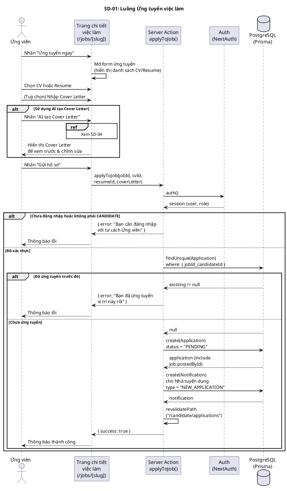
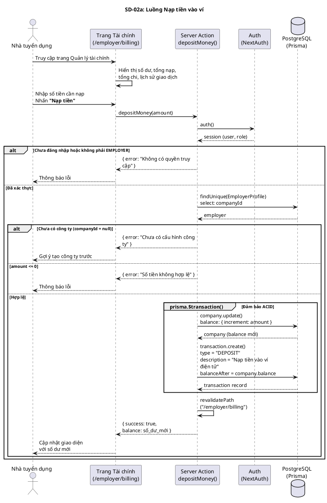
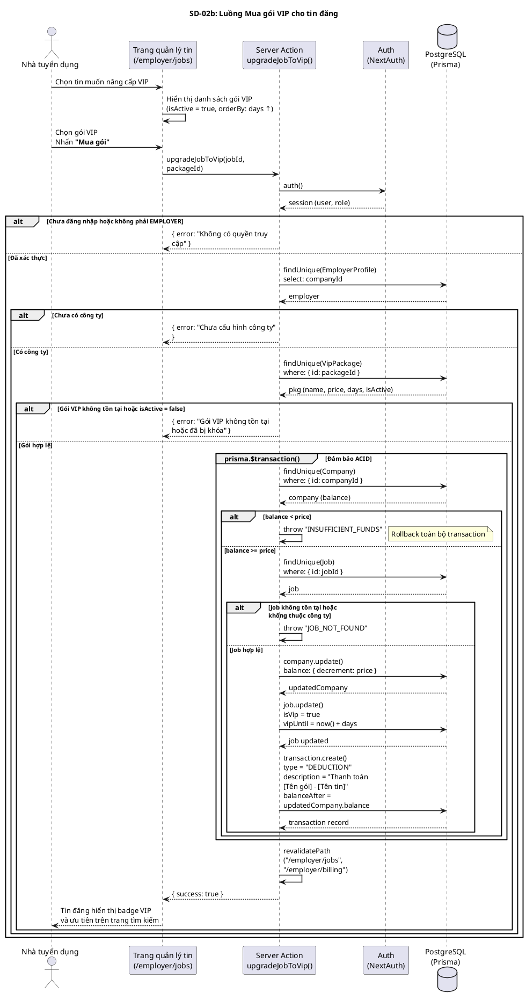
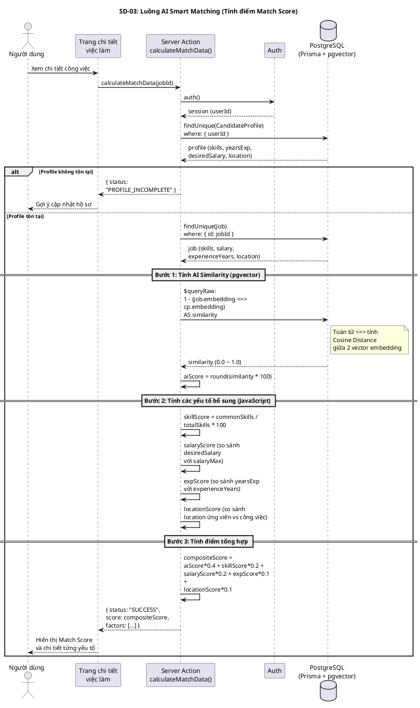
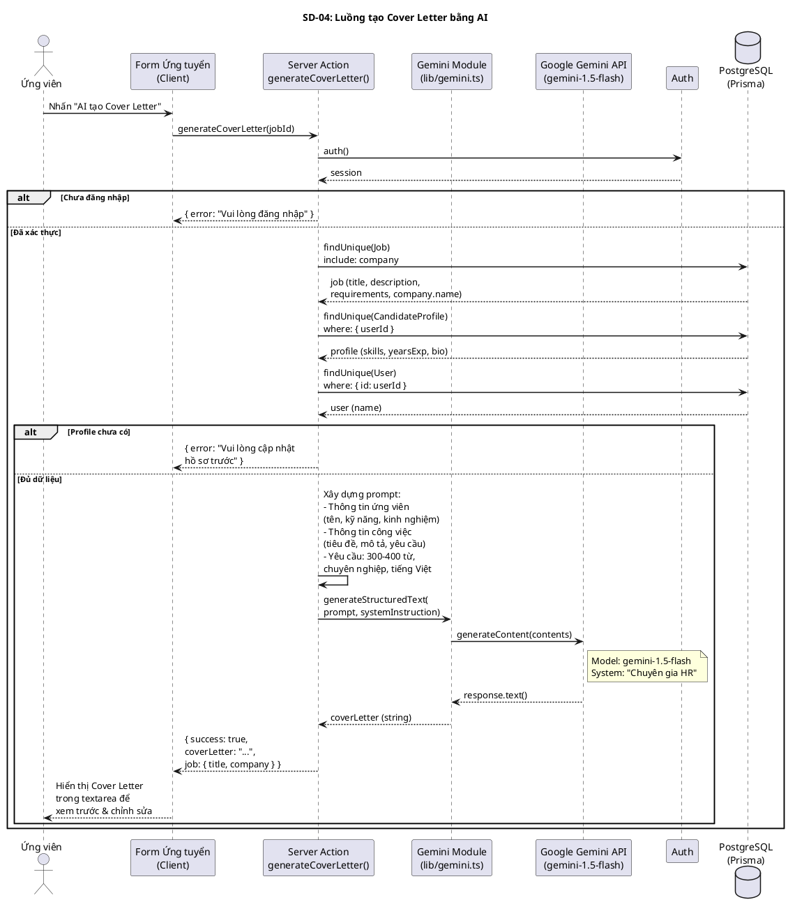
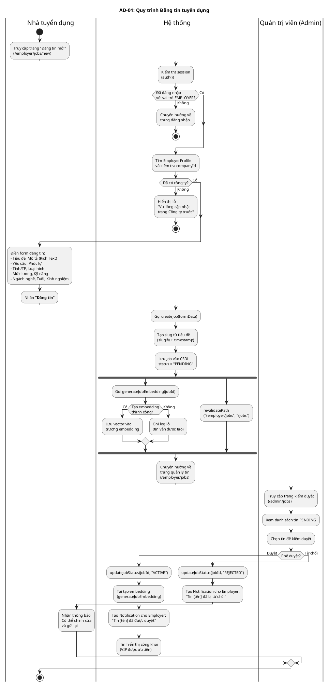
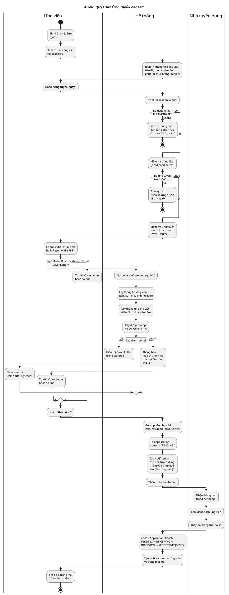
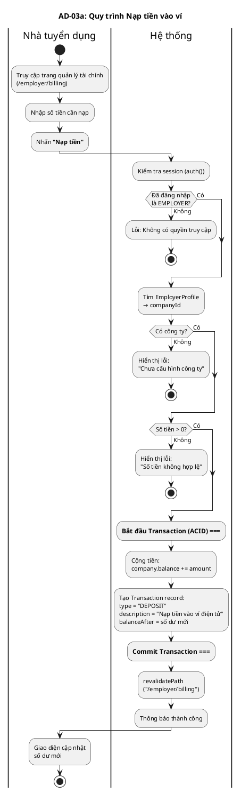
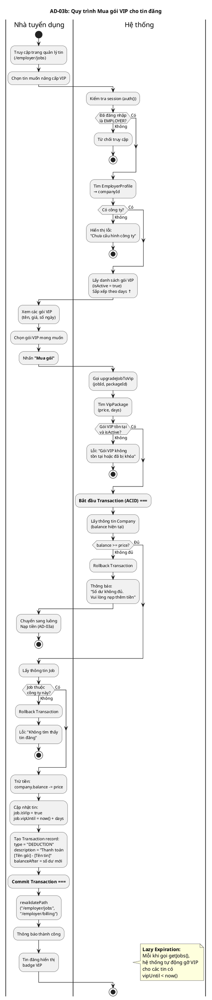

# Mã PlantUML - Sơ đồ Tuần tự & Hoạt động hệ thống JobNow

---

## SD-01: Luồng Ứng tuyển việc làm

---

## SD-02a: Luồng Nạp tiền vào ví

---

## SD-02b: Luồng Mua gói VIP cho tin đăng

## SD-03: Luồng AI Smart Matching

---

## SD-04: Luồng tạo Cover Letter bằng AI

---

## AD-01: Quy trình Đăng tin tuyển dụng

---

## AD-02: Quy trình Ứng tuyển đầy đủ

---

## AD-03a: Quy trình Nạp tiền vào ví

---

## AD-03b: Quy trình Mua gói VIP cho tin đăng

---

## Hướng dẫn sử dụng

1. **Online**: Copy đoạn code PlantUML và paste vào [PlantUML Online Server](https://www.plantuml.com/plantuml/uml/) để xem ngay.
2. **VS Code**: Cài extension "PlantUML" và nhấn `Alt+D` để preview.
3. **Export**: Xuất ra file PNG/SVG để chèn vào báo cáo Word.
