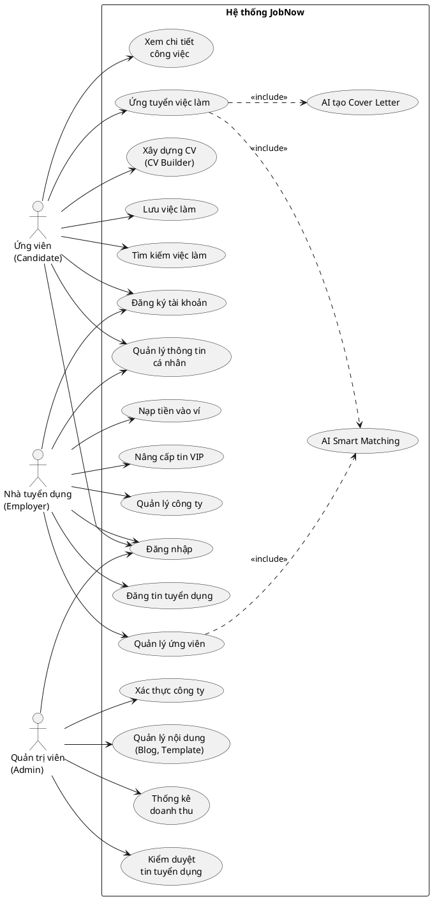
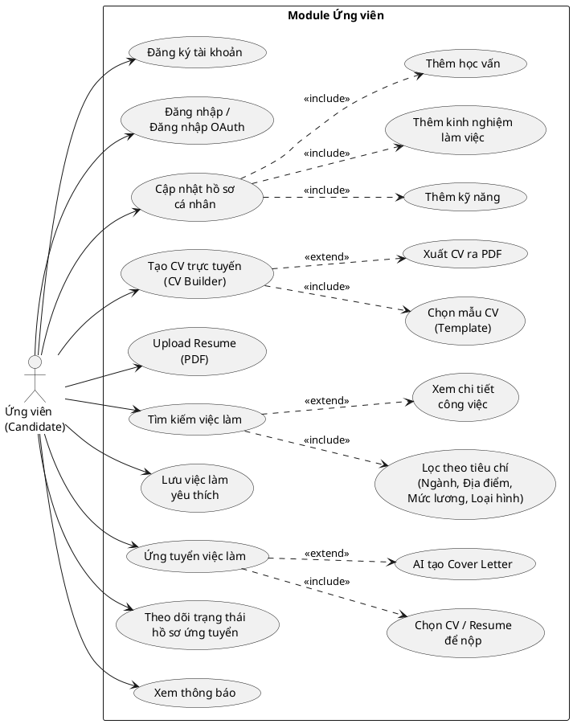
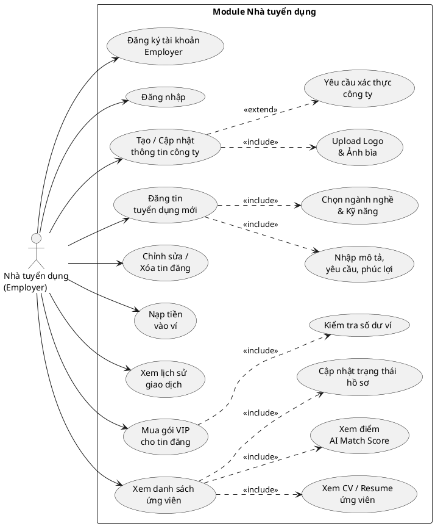
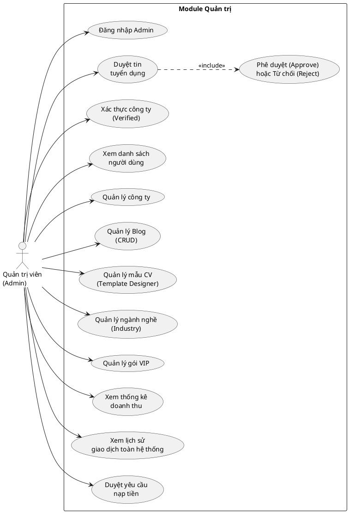

# Mã PlantUML - Sơ đồ Use Case hệ thống JobNow

---

## UC-00: Use Case Tổng quát hệ thống JobNow

---

## UC-01: Use Case phân rã - Ứng viên (Candidate)

---

## UC-02: Use Case phân rã - Nhà tuyển dụng (Employer)

---

## UC-03: Use Case phân rã - Quản trị viên (Admin)

---

## Hướng dẫn sử dụng

1. **Online**: Copy đoạn code và paste vào [PlantUML Online Server](https://www.plantuml.com/plantuml/uml/) để xem ngay.
2. **VS Code**: Cài extension "PlantUML" và nhấn `Alt+D` để preview.
3. **Export**: Xuất ra file PNG/SVG để chèn vào báo cáo Word.
